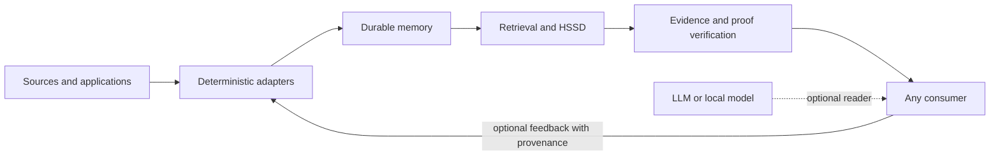

# Architecture

Horizon Memory separates durable state, retrieval, proof and consumption. This
keeps a model useful without allowing it to rewrite memory authority.

## Stable surface

The `horizon_memory` namespace provides:

- scoped, versioned writes;
- reads and immutable read views;
- terminal deletion;
- crash-aware recovery;
- compaction and conservative reclamation;
- typed causal facts and programs;
- bounded evidence packs;
- HSSD compilation, selection and proof verification;
- explicit result and abstention states;
- audit and storage ledgers.

## Durable engine

The private implementation namespace `horizon_memory._engine` contains the
append-only log, artifact descriptors, manifests, publication protocol,
recovery, compaction, snapshots and garbage-collection machinery. Applications
should not import it directly.

The central publication rule is that an applied acknowledgment must correspond
to durable published state. Recovery observes published authority and does not
silently invent repairs.

## Evidence boundary

Evidence is treated as untrusted input until its identity, source digest, span,
scope and version are checked. Candidate generators are replaceable and may be
wrong. A verifier, not a ranking score, decides whether a result has authority.

## Research retrieval

`horizon_memory.research` exposes experimental proof-pressure and feedback
transport engines. The namespace is opt-in because retrieval hypotheses evolve
faster than the storage contract.

These engines may combine lexical candidates with causal observables, hard
exclusions and evidence budgets. They must continue to report paired BM25
baselines and may not convert retrieval hit rate into an answer-accuracy claim.

## External readers

`horizon_memory.adapters` connects bounded evidence to independent readers.
Adapters cannot alter durable memory, declare proof validity or enable network
access implicitly. Remote access is application-authorized and outside the
offline core.

## Current boundary

The durable substrate currently stores unsigned-byte values and references
richer application content through identities and provenance. Natural-language
compilation supports only explicitly implemented operation families. Unknown or
ambiguous input abstains.

This boundary is deliberate: a narrow verified operation is part of Horizon; a
broad unverified guess is not.
