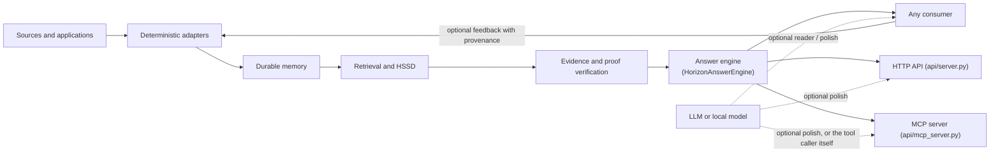

# Architecture

Horizon Memory separates durable state, retrieval, proof and consumption. This
keeps a model useful without allowing it to rewrite memory authority.

## Theoretical foundations

Horizon's design is not an arbitrary collection of engineering choices; it follows from one
falsifiable hypothesis. **Memory reliability and generative fluency are different problems**, and
a small, deterministic, composable machine can outperform a generative model specifically at the
first one, precisely because it never has to imagine, complete, or reinterpret a source. This is
a modern, empirically-tested revival of classical (GOFAI-style) symbolic reasoning, deliberately
combined with modern tools GOFAI never had: type systems, information theory, temporal databases,
versioned ontologies, error-correcting codes and cryptographic provenance. Full origin story in
[Origin and design lineage](ORIGIN_AND_DESIGN.md); the numbers behind every claim below are in
[Benchmarks](BENCHMARKS.md), including the negative results that narrowed this list down.

A few named theories carry most of the actual engineering weight:

- **HSSD (Sufficient-Statistic Decoder).** The core reframing behind everything above: a question
  is compiled into an *operation* (`LOOKUP`, `COUNT_DISTINCT`, `SUM`, `INTERVAL`, `EXPLAIN_CAUSE`,
  ...) plus its *operands* — and, critically, a set of non-compensable **obligations** (role,
  clock, unit, cause, identity, completeness) that are checked separately from ordinary topical
  relevance. A claim can be the most relevant sentence in the corpus and still fail an obligation;
  when that happens, the operation does not silently execute on a best guess, it abstains. This is
  the same "obligation vs. relevance" distinction `ClaimGenerator`'s contradiction channel and
  `proof_dossier`'s anchor/specificity bonuses already apply in practice, described above.
- **D45 (authorized semantic hypergraph).** Every extracted claim carries its span, provenance,
  role, polarity, modality and clock as distinct, non-mergeable properties — a claim is never
  quietly collapsed with a paraphrase or a contradicting restatement just because they're
  topically close.
- **Sigma-PBA (binding propagation calculus).** Bindings between typed facts only ever propagate
  forward from testified, proof-carrying evidence. Two incompatible candidate answers are never
  resolved by picking whichever scores higher; an environment where they genuinely conflict stays
  contested rather than being silently averaged away.
- **HPPS (Proof-Pressure Search).** The retrieval mechanism this project has actually validated
  most extensively against a real baseline: it protects a lexical core and admits other candidate
  evidence only under an explicit proof/evidence-budget pressure, not a raw similarity score. See
  [Benchmarks](BENCHMARKS.md#retrieval-against-bm25) for the paired BM25 comparisons.

**The GOFAI/Transformer reinterpretation, specifically.** A newer, still-experimental line asks
whether the same discipline can be expressed as a deterministic reinterpretation of a Transformer's
own query/key/value dataflow, rather than as a separate symbolic pipeline bolted alongside it:
**Proof Attention** replaces a learned `Q`/`K`/`V` and softmax-weighted averaging with an HSSD
obligation as `Q`, a D45 typed tuple as `K`, an exact attested span as `V`, and a
provenance-semiring join in place of floating-point averaging — heads become typed proof
channels, and only an answer invariant across every complete, surviving interpretation is ever
returned. This sits on top of two supporting layers: **H-DEM** (Deterministic Epistemic Machine),
an explicit possible-world engine that computes the provably certain answer over a finite set of
typed alternatives, and **H-DCA** (Deterministic Context Automaton), a lighter, packed-bitset
runtime that soundly *under*-approximates H-DEM (it may abstain where H-DEM would resolve, but
never resolves to a different answer than H-DEM would). The combined candidate architecture is
called **H-PLT** (Proof-Lattice Transformer).

**Status, stated plainly.** This is real, working code, not a metaphor: `Proof Attention` has been
checked for exact equivalence against Sigma-PBA on generated, structured data, and an
H-FMRL/H-DEM/H-PLT bridge (H-FMRL supplies typed per-token morphological alternatives) is already
the mechanism behind the opt-in Portuguese atomic-relation pack described below. It is **not**
validated as a general open-language accuracy win, is not a drop-in replacement for a trained
Transformer, and is not a new core engine — every one of these is either a bounded, per-language
pack with its own explicit holdout gate, or a candidate architecture still gated on further
evidence. See [Benchmarks](BENCHMARKS.md#what-is-not-yet-solved) for exactly what has and hasn't
cleared that bar so far, including refuted intermediate designs this line already tried and
abandoned along the way.

## Stable surface

The `horizon_memory` namespace provides:

- scoped, versioned writes;
- reads and immutable read views;
- terminal deletion;
- crash-aware recovery;
- compaction and conservative reclamation;
- typed causal facts and programs;
- bounded evidence packs;
- HSSD compilation, selection and proof verification;
- exact-span claim sealing, provenance-carrying proof dossiers and lossless
  rendering (`claim_composer`, `proof_dossier`, `lossless_proof_answer`);
- explicit result and abstention states;
- audit and storage ledgers.

## Durable engine

The private implementation namespace `horizon_memory._engine` contains the
append-only log, artifact descriptors, manifests, publication protocol,
recovery, compaction, snapshots and garbage-collection machinery. Applications
should not import it directly.

The central publication rule is that an applied acknowledgment must correspond
to durable published state. Recovery observes published authority and does not
silently invent repairs.

`HorizonMemory` keeps a small, bounded LRU cache of already-opened generation
handles, keyed by the immutable manifest digest that identifies a generation.
A write always produces a new digest rather than mutating an old one, so the
cache needs no invalidation logic for correctness — it only removes redundant
WAL re-verification on repeated reads against a generation that has not
changed, a real (measured, ~2.7x) latency improvement on the routing path
with no behavioral change.

## Evidence boundary

Evidence is treated as untrusted input until its identity, source digest, span,
scope and version are checked. Candidate generators are replaceable and may be
wrong. A verifier, not a ranking score, decides whether a result has authority.

## Search and candidate routing

Search never produces authority directly; it produces candidates a verifier
then checks. A `CandidateGenerator` scores documents or claims against a
query and returns a ranked `CandidateList`; `HorizonVerifier` re-opens each
candidate's own source in the durable store and checks its identity, span,
version and scope. `SemanticRouter.route()` ties the two together and
returns exactly one `RouteState`: `EVIDENCE` when verified candidates
satisfy the query, `ABSTENTION` when none do, or `ABSTAIN_SCOPE` when the
query itself targets a scope the caller isn't authorized for — never a
silent empty result standing in for a failure.

Two granularities of candidate generator exist. Whole-document generators
(lexical, BM25, dense, hybrid, causal-weave) return one candidate per fact.
`ClaimGenerator` instead splits a document into sentence-level claims (never
splitting a decimal number or code punctuation, `claim_spans`) and scores
each one independently against six typed channels computed by
`MaterializedRawCausalSyndromeIndex` — lexical overlap, character-trigram
("sublexical") overlap for paraphrase and typo robustness, entity match,
relation match, an "observable" exact-value-match signal, and a
contradiction penalty when a claim's polarity or modality conflicts with the
query — combined by a fixed weighted sum (`DEFAULT_WEIGHTS`; only lexical,
sublexical and contradiction are non-zero by default, chosen and regression-
tested against a real modal-distractor failure, not a default guess). A
document can contain one claim that answers a query and several that don't;
claim-level generation lets those compete independently for budget instead
of the whole document winning or losing as one unit.

Claim/sentence boundaries and the lexical/sublexical channels above are script-aware, not
English-only: Chinese text (which has no whitespace word boundaries) is segmented with a small,
self-built maximum-matching word dictionary rather than character bigrams, after an earlier
bigram-based version was found to saturate on combinatorial noise in a small candidate pool. This
is the mechanism behind this project's own Simplified/Traditional Chinese memory-delivery results
(see [Benchmarks](BENCHMARKS.md)); the dictionary is corpus-scoped by design, not a general-purpose
NLP model, and a since-tested attempt to widen it with a large general Chinese wordlist was
reverted after it doubled the false-positive rate on unrelated content for no measured gain.

Routing admission can also be conformally calibrated:
`ConformalClaimGenerator`/`ConformalDocumentGenerator` wrap a base generator
with a `ConformalCalibrator` fit on a held-out calibration set, and admit a
candidate whenever its calibrated p-value exceeds `epsilon` — a statistical
marginal-coverage guarantee ("the true source is in the routed set with
probability at least 1-epsilon"), not a ranked top-k cutoff. A *smaller*
epsilon is a *stronger* guarantee and admits *more* candidates, trading
precision for a bound on how often the right source is missed outright.

Selection happens at two budgets, not one. `EvidencePack.budgeted_items()`
fills an acquisition-stage budget from verified candidates across every
routed source, with optional merge behavior: `global_sort_alpha` replaces
the default rank-major fill with one blended sort key per item (document-
level `source_priority` weighted against the item's own channel relevance),
and `dedup_threshold` rejects near-duplicate claims. `proof_dossier.
build_proof_dossier` then fills a second, tighter final-answer budget from
that acquisition pool — optionally as budget-constrained submodular
selection (`submodular_budget_fill`) rather than a plain rank-major cut —
with `anchor_bonus`/`specificity_bonus` biasing selection toward claims
carrying a number, proper noun or other locally rare token: the kind of
content most likely to be the one fact a query actually needs, not just a
topically related sentence.

`dedup_threshold`'s own plain Jaccard-similarity check has a more elaborate history than its size
suggests, worth naming as an example of how this project promotes a mechanism. An earlier,
considerably more sophisticated design — a calibrated tournament between competing merge tactics,
reusing an orphaned reliability-scoring strategist from this project's own earlier research —
reached the same measured coverage gain as this plain dedup check, exactly, on the same held-out
episodes. Per this project's own discipline (demote to the honest, simpler mechanism whenever a
plain control ties a fancier one, rather than keep the more impressive name), the calibrated
tournament was not the thing promoted: the plain Jaccard check was, since it produces the
identical result with no per-deployment calibration step required. The more elaborate mechanism
remains in `lab/` as a validated, but not simpler, alternative.

None of this changes what counts as authoritative. However a candidate is
scored, ranked or admitted, it only ever proposes; `HorizonVerifier` is
still what decides whether a result is trustworthy, per the boundary above.

`horizon_memory.content_safety` adds a separate, narrower, **opt-in** gate on
the content itself: a deterministic, zero-LLM keyword/pattern screen for
physical-harm instructions, malware, sensitive PII/credentials and CSAM
indicators. Off by default; pass a `SafetyPolicy` at ingestion
(`RouteDocument`) or query time (`SemanticRouter.route`) to enable it, which
aborts to `RouteState.ABSTAIN_UNSAFE_CONTENT` on an unsafe query or unsafe
verified evidence rather than silently dropping the offending item. See
`SECURITY.md` for the full scope and its explicit limits.

## Answer engine

Everything above (routing, verification, evidence budgets, HSSD) is machinery a caller could use
directly, but most real consumers want one call that takes a question plus a document set and
returns a verified answer. `HorizonAnswerEngine.answer(question, documents)` is that call: it
routes, verifies, budgets and renders in one pass, returning an `AnsweredResult` — `state`
(`"RESOLVED"` or an abstain-state name; a confident wrong answer never happens, the engine
declines instead), `answer_text`/`evidence_text` (the composed, verified evidence — the same text
under two names, `answer_text` kept for backwards compatibility), `direct_answer` (the separate,
optional minimal-answer channel described above), and telemetry (`documents_considered`,
`verified_candidates`, `answer_bytes`, `chosen_size`) a caller can use to reason about how close a
corpus is to the engine's own internal budgets.

Every tunable value the engine consumes — claim-routing channel weights, acquisition/answer byte
budgets, the shortlist size and relevance gate the final answer is picked from, the answer
selector, HPPS exploration reserve — lives in one frozen `EngineProfile` dataclass, passed in at
construction (`HorizonAnswerEngine(profile=..., scope_id=..., session_id=...)`), not scattered
across call sites. A profile is just data: `EngineProfile.save()`/`.load()` round-trip it through
JSON, so retuning a deployment never means touching code.

Three named presets ship, because the right values genuinely differ by deployment scale, and
corpus size alone does not reliably indicate which one applies (measured directly: a real,
small technical-QA corpus's own candidate-pool size was statistically indistinguishable from a
large benchmark episode's) — so this is a deliberate, named choice an operator makes, not
something the engine infers automatically:

- **`DEFAULT_PROFILE`** ("Scale Memory") — tuned for a large corpus (hundreds of documents and
  up); the exact configuration behind this project's own published judge-scored results (see
  [Benchmarks](BENCHMARKS.md)), deliberately conservative about how much evidence competes for
  the final answer so a huge corpus never dilutes a precise one.
- **`TEAM_MEMORY_PROFILE`** ("Team Memory") — a measured middle ground for a medium corpus (a
  small team's internal docs).
- **`PERSONAL_MEMORY_PROFILE`** ("Personal Memory") — favors completeness over precision-per-byte
  for a small, personal-scale corpus, where the default's own anti-dilution caution can drop the
  one sentence carrying the concrete answer. Recommended starting point for that class of
  deployment; see [Benchmarks](BENCHMARKS.md#real-world-horizonanswerengine-validation-five-live-corpora-136-hand-verified-questions)
  for the real-corpus validation behind that recommendation.

## Deployment surfaces (`api/`)

`api/` is the packaged, runnable surface that wraps `HorizonAnswerEngine` for an actual
deployment — HTTP and MCP transports, a shared choke point, and the one place model-facing
network calls are allowed to originate from. It is a separate concern from the AGPL core: see
[Licensing policy](LICENSE_POLICY.md) for why this split exists and what it does and doesn't
mean for licensing.

Both transports share `api/_engine_bridge.py` rather than each reimplementing request handling:
`maybe_answer(question, documents)` is the one function both `api/server.py` (`POST
/v1/answers`) and `api/mcp_server.py` (the `horizon_ask` tool) call, so a behavior added at this
layer — activation gating, request validation, the optional polish step — never has to be kept in
sync across two copies.

**Activation mode** decides *when* the engine runs at all, as deploy-time configuration
(`HORIZON_ACTIVATION_MODE`), never a per-request field: `"direct"` (the default) runs the engine
unconditionally on every request; `"keyword"` gates it behind a small, closed, server-configured
trigger-phrase list (`HORIZON_ACTIVATION_KEYWORDS`), returning `state: "not_activated"` with zero
pipeline cost when a question matches none of them. The two modes serve different integration
shapes: an orchestrating LLM agent deciding for itself whether to call `horizon_ask` already *is*
an activation decision (tool mode, the recommended default, needs no keyword list at all);
keyword mode is for a deployment with no LLM in the loop making that call.

**Polish** (`OpenAICompatiblePolishAdapter`, `horizon_memory.adapters`) is the one place a model
call can happen, and it is structurally incapable of deciding facts: it receives only Horizon's
own already-verified `answer_text`, is instructed not to add/remove/invent content, and its output
is a separate, clearly-labeled `polished_answer` field that never replaces `answer_text` — a
failed or errored polish call degrades to the unmodified verified answer rather than affecting it.
The destination endpoint and credential-holding env-var name are read only from this process's own
environment (`HORIZON_POLISH_BASE_URL`/`HORIZON_POLISH_API_KEY_ENV`), never accepted as request
fields, after an earlier version that did accept them was found to let any caller redirect the
outbound call and a named secret to a host of its own choosing.

Every request-shaped safety property lives at this layer, not inside the engine itself: request
body/field size limits, a bounded (TTL + LRU) in-memory answer store so an anonymous caller can't
grow process memory without bound, and strict JSON body validation.

The HTTP transport also requires a bearer token (`machine_auth.py`) on every request except the
health check, and rate-limits every request (`rate_limit.py`) with a token bucket that refills
continuously rather than resetting on a fixed clock tick. The token is generated once on first run,
persisted locally, and additionally bound to a best-effort OS machine identifier recomputed on
every request, so a copied credentials file stops working on a different machine — a real, but
deliberately narrow, property scoped to "one operator, one machine," not multi-tenant auth. MCP
(stdio transport, spawned directly by the local client) deliberately carries neither mechanism:
there is no network hop for a token or rate limit to protect there. See
[`../api/README.md`](../api/README.md) for the exact current limits and the full authentication
model.

## Research retrieval

`horizon_memory.research` exposes experimental proof-pressure and feedback
transport engines. The namespace is opt-in because retrieval hypotheses evolve
faster than the storage contract.

These engines may combine lexical candidates with causal observables, hard
exclusions and evidence budgets. They must continue to report paired BM25
baselines and may not convert retrieval hit rate into an answer-accuracy claim.

The public answer facade can opt into HPPS for final verified-evidence selection
through `EngineProfile(answer_selector="hpps")`. HPPS ranks only claims that have
already crossed the source/provenance boundary. Its `selector_proof_closed` and
`selector_residual` telemetry must be inspected separately: a useful shortlist is
not automatically a complete typed answer proof.

The consumer boundary exposes two non-interchangeable outputs. `evidence` is the verified,
provenance-bearing claim selection (the legacy `answer`/`answer_text` name remains as a
backwards-compatible alias). `direct_answer` is an optional minimal result with its own state,
method, sources, closure flag and residual obligations. Failure to derive a direct answer never
erases or weakens the evidence channel.

### Promoted deterministic EN atomic relation pack

`english_atomic_relations.py` is a bounded source reader, not a new truth authority. The query is
compiled into one missing `ARG1` or `ARG2`; exact source spans form finite readings; productive and
WordNet-exception morphology connects surface predicates; disagreement contests and absence abstains.
The result records source/question/resource hashes, answer/predicate/known spans, the construction
rule and clause force. Interrogative, conditional, modal and negated readings must never be silently
written as positive facts.

The pack is opt-in and source-scoped. `OpenTextHorizonMemory.answer_atomic_relation_en` requires one
attested FactId, preventing a failed scan over unrelated documents from masquerading as closed-world
completeness. The old `answer()` and retrieval defaults are unchanged. A proof-closed result can be
serialized into a 140-byte envelope and reopened only by rerunning the same checksummed morphology
pack against the same source and question.

Promotion evidence is cross-treebank, not the development split: EWT dev/train exceeded 90%, then
the untouched GUM test reached 93.90% positive accuracy and 97.47% selective precision. The mechanism
covers only atomic one-token `nsubj+obj` probes under its finite grammar; PT/ZH and phrase/multihop
generalization remain research work.

### Promoted deterministic PT atomic relation pack — reachable, tested, not holdout-confirmed

`portuguese_atomic_relations.py` shares the same language-neutral surface kernel as the EN pack
above, but Portuguese's closed-class morphology (clitics, contractions, prepositional governance)
is too rich for a raw-token skip list — an earlier version tried exactly that, tuned to 100% on one
development treebank, and then failed on every fresh test split it was pointed at. Its replacement
is a genuine typed constraint-satisfaction resolver, reusing the same theoretical stack named
above: **H-FMRL** supplies typed per-token morphological alternatives, **H-DEM**/**H-DCA** turn
prepositional-phrase governance and clause-local competition into an explicit constraint problem,
and **H-PLT** resolves a role only when every complete interpretation world agrees.

`RoleReadResult`, `read_pt_atomic_relation`, `resolve_pt_surface_role` and
`OpenTextHorizonMemory.answer_atomic_relation_pt` are exported from the stable top-level
`horizon_memory` namespace, not gated behind `horizon_memory.research` — a deliberate product
decision, made explicitly before the pack cleared the same bar as its EN counterpart. **This is
the honest, stated difference from the EN pack above**: the EN pack was wired into the stable
namespace only after clearing a fresh, never-touched holdout (UD English-GUM, 95.12% positive,
97.50% selective). The PT pack's own first fresh holdout (`UD_Portuguese-CINTIL` test) **failed
its promotion bar by a narrow margin** — 92.39% positive accuracy clears the >=90% gate, but
94.44% selective precision misses the >=95% gate by 0.56pp. Treat the PT pack as reachable and
useful today, not as evidence it has reached the same standing as the EN pack; see
[Benchmarks](BENCHMARKS.md#pt-atomic-relation-pack--early-raw-token-adapter-rejected-h-fmrlh-demh-plt-bridge-now-in-core-opt-in-holdout-confirmation-failed-narrowly)
for the full numbers and per-error diagnosis.

## Open-text and structured-input facades

Two different opt-in facades extend the authority boundary above to input that isn't already a
`RouteDocument` a caller built by hand, for two different input shapes.

**`OpenTextHorizonMemory`** is for arbitrary, unstructured text. It records each input document
under the weakest predicate that is universally true of it — a sealed source contains this exact
`surface_document` span — inventing no entity, relation or meaning at ingestion time. Verified
documents then enter the same deterministic route/verify/compose path described above; the two
atomic-relation packs' `answer_atomic_relation_en`/`_pt` entry points, and the CJK/PT-BR memory-
delivery transfer results in [Benchmarks](BENCHMARKS.md), all run through this facade. It is
deliberately not sold as text understanding — it makes exactly one claim (this span exists,
unmodified, in this source) and lets everything downstream stay proof-carrying on top of that.

**The authorized typed sidecar** (`docs/TYPED_SIDECAR.md`) is for the opposite shape: a caller who
already has structured facts (a database row, a tool result, an event stream) and wants them bound
to schema/rule identity, source microcitations, capabilities, lifecycle and completeness proofs
without inventing an extraction step at all. Where the open-text facade's job is turning
unstructured text into the weakest true claim, the sidecar's job is attaching a strong, explicit
authority contract to input that is already structured — the two are complementary entry points
into the same durable/evidence/proof core, not competing designs.

## Research graduation

`lab/` is an experimental boundary, not a permanent second implementation of
Horizon. A mechanism that passes its frozen gate, survives an independent or
disjoint evaluation, and improves the real pipeline should be promoted into
`src/horizon_memory/` with tests at its actual call site. The core port must use
opt-in, backwards-compatible defaults until its production configuration is
validated.

A lab result is not eligible for promotion when it depends on benchmark-specific
fixtures, reimplements a production class, wins only against a cloned baseline,
fails a non-compensable subgroup/coverage gate, or has not been reproduced through
the real public/core path. Failed and partial mechanisms remain in `lab/` as
evidence; they are not silently deleted or presented as shipped capabilities.

The namespace also exposes `collapse_evidence_items`: an opt-in mechanism that
excludes superseded restatements of a value (a revised date, a reversed
decision) from an already-verified evidence pool, so a downstream reader
isn't handed several conflicting values with nothing marking which is
current. It reuses the stable namespace's `TypedCausalExecutor` unmodified
for resolution — the same clock-and-orbit logic `typed_causal_program`
already validated for query answers, repurposed here as a general
"which-value-is-current" primitive — and only adds detection on top: does a
claim carry an anchor (a number or proper noun) at all. Measured, not
assumed, with mixed results across language and noise conditions; see
`RESEARCH.md` for the honest numbers and why it stays opt-in.

`narrative_composition.py` is a second, independent opt-in mechanism in the same namespace: it
composes multiple already-linked typed facts (from `TypedCausalExecutor`) into one coherent
rendered narrative — ordering by cause/contrast/sequence relations read directly off each fact's
own fields, never inventing a relation — instead of answering only one atomic fact at a time. It
is exported but **never wired into any default routing/ranking/answer path**: a caller must
already hold correctly-linked typed facts and invoke it explicitly. Entity/fiber linking from raw
unstructured text (deciding which facts describe the same real-world thing in the first place)
remains unsolved and is exactly what `collapse_evidence_items` above is the closest existing
attempt at, not something this module does for you.

## The validated reading pipeline (partially promoted; full pipeline still a private prototype)

A private research line reached a different, more directly validated
mechanism for turning stored facts into a reader-ready evidence pack, described
in five stages below. Parts of it have since moved into the stable namespace:
claim-level (sentence-span, not whole-document) candidate generation and
conformal-calibrated document routing, the mechanisms behind stages 1-2, now
ship as `ClaimGenerator` and `ConformalClaimGenerator`/`ConformalDocumentGenerator`,
with the budget-fill merge options (`global_sort_alpha`, `source_priority`,
`dedup_threshold`) on `EvidencePack.budgeted_items()`. Stages 3-4 — exact-span
claim sealing/verification and provenance-carrying packet assembly, and the
plain, lossless rendering step — now ship too, as `claim_composer`
(`ClaimSource`, `AuthorizedClaim`, `extract_authorized_claims`),
`proof_dossier` (`build_proof_dossier`, including the budget-fill merge
options above plus `submodular_budget_fill`, `anchor_bonus` and
`specificity_bonus`) and `lossless_proof_answer`
(`render_lossless_proof_answer`). Stage 5 — the reading contract itself — is
a downstream-consumer instruction, not a storage mechanism, and stays out of
the core by design; see `horizon_memory.adapters` for where a caller wires an
actual reader.

The pipeline has five stages:

1. **Full claim scan.** Every factual claim available to an episode is
   extracted up front — not only a pre-filtered "supporting" subset. Working
   from the complete candidate pool, rather than a subset chosen too early,
   turned out to matter more than any later ranking refinement.
2. **Budget-aware causal selection.** Claims are scored for relevance to the
   query's causal thread and packed into a fixed byte budget. The scorer
   specifically protects the most causally central thread from being starved
   when many competing turns want the same budget, rather than spreading
   the budget evenly regardless of relevance.
3. **Packet assembly with provenance.** Selected claims are packaged with
   their source, obligations (role, timing, unit, cause, identity,
   completeness) and a verifiable digest. Obligations are treated as
   non-negotiable requirements distinct from ordinary relevance — a claim can
   be topically relevant and still fail an obligation.
4. **Plain natural-language rendering.** The packet is rendered as an
   ordinary flat list of complete sentences — no tags, no internal IDs, no
   visible section headings. Controlled ablations found that every attempt to
   add visible structure (tags, headings, explicit scaffolding) to the
   evidence surface *hurt* small readers, while a plain natural-language
   surface with byte-identical content did not. This was the single largest
   reader-side improvement found in the whole program.
5. **An explicit extractive reading contract.** The consumer is instructed to
   answer only from the supplied evidence, preserve exact names, numbers and
   relations, combine every relevant statement into one answer, and abstain
   explicitly rather than guess when the evidence does not support an answer.
   This contract, held constant, is what let stages 1-4 be evaluated on a
   level field.

This pipeline, at a byte budget matched to what it naturally uses, was
compared against a strong lexical baseline (BM25) at both a matched budget
and a substantially larger one, scored by a validated LLM-judge instrument
(see [Benchmarks](BENCHMARKS.md)). It won at both budgets, and giving the
baseline more budget did not close the gap. What limits accuracy beyond that
point has since been settled by a dedicated causal test, not left open:
raising a reader's actual evidence coverage at the identical byte budget did
not move the judge score in a statistically distinguishable way, confirmed
by a working negative control. The remaining gap is explained by the
reader's own difficulty composing multiple facts it already has into one
correct answer, not by missing evidence — see
[Benchmarks](BENCHMARKS.md#reading-comprehension-pilot-program) for the exact
numbers. This reframes further work on this pipeline toward the consumer-side
reading contract or reader capacity, not toward more retrieval/ranking work.

## External readers

`horizon_memory.adapters` connects bounded evidence to independent readers.
Adapters cannot alter durable memory, declare proof validity or enable network
access implicitly. Remote access is application-authorized and outside the
offline core.

## Current boundary

The durable substrate currently stores unsigned-byte values and references
richer application content through identities and provenance. Natural-language
compilation supports only explicitly implemented operation families. Unknown or
ambiguous input abstains.

This boundary is deliberate: a narrow verified operation is part of Horizon; a
broad unverified guess is not.
