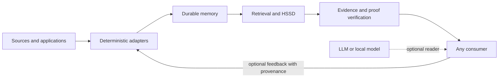

# Architecture

Horizon Memory separates durable state, retrieval, proof and consumption. This
keeps a model useful without allowing it to rewrite memory authority.

## Stable surface

The `horizon_memory` namespace provides:

- scoped, versioned writes;
- reads and immutable read views;
- terminal deletion;
- crash-aware recovery;
- compaction and conservative reclamation;
- typed causal facts and programs;
- bounded evidence packs;
- HSSD compilation, selection and proof verification;
- explicit result and abstention states;
- audit and storage ledgers.

## Durable engine

The private implementation namespace `horizon_memory._engine` contains the
append-only log, artifact descriptors, manifests, publication protocol,
recovery, compaction, snapshots and garbage-collection machinery. Applications
should not import it directly.

The central publication rule is that an applied acknowledgment must correspond
to durable published state. Recovery observes published authority and does not
silently invent repairs.

`HorizonMemory` keeps a small, bounded LRU cache of already-opened generation
handles, keyed by the immutable manifest digest that identifies a generation.
A write always produces a new digest rather than mutating an old one, so the
cache needs no invalidation logic for correctness — it only removes redundant
WAL re-verification on repeated reads against a generation that has not
changed, a real (measured, ~2.7x) latency improvement on the routing path
with no behavioral change.

## Evidence boundary

Evidence is treated as untrusted input until its identity, source digest, span,
scope and version are checked. Candidate generators are replaceable and may be
wrong. A verifier, not a ranking score, decides whether a result has authority.

`horizon_memory.content_safety` adds a separate, narrower, **opt-in** gate on
the content itself: a deterministic, zero-LLM keyword/pattern screen for
physical-harm instructions, malware, sensitive PII/credentials and CSAM
indicators. Off by default; pass a `SafetyPolicy` at ingestion
(`RouteDocument`) or query time (`SemanticRouter.route`) to enable it, which
aborts to `RouteState.ABSTAIN_UNSAFE_CONTENT` on an unsafe query or unsafe
verified evidence rather than silently dropping the offending item. See
`SECURITY.md` for the full scope and its explicit limits.

## Research retrieval

`horizon_memory.research` exposes experimental proof-pressure and feedback
transport engines. The namespace is opt-in because retrieval hypotheses evolve
faster than the storage contract.

These engines may combine lexical candidates with causal observables, hard
exclusions and evidence budgets. They must continue to report paired BM25
baselines and may not convert retrieval hit rate into an answer-accuracy claim.

The namespace also exposes `collapse_evidence_items`: an opt-in mechanism that
excludes superseded restatements of a value (a revised date, a reversed
decision) from an already-verified evidence pool, so a downstream reader
isn't handed several conflicting values with nothing marking which is
current. It reuses the stable namespace's `TypedCausalExecutor` unmodified
for resolution — the same clock-and-orbit logic `typed_causal_program`
already validated for query answers, repurposed here as a general
"which-value-is-current" primitive — and only adds detection on top: does a
claim carry an anchor (a number or proper noun) at all. Measured, not
assumed, with mixed results across language and noise conditions; see
`RESEARCH.md` for the honest numbers and why it stays opt-in.

## The validated reading pipeline (partially promoted; full pipeline still a private prototype)

A private research line reached a different, more directly validated
mechanism for turning stored facts into a reader-ready evidence pack, described
in five stages below. Parts of it have since moved into the stable namespace:
claim-level (sentence-span, not whole-document) candidate generation and
conformal-calibrated document routing, the mechanisms behind stages 1-2, now
ship as `ClaimGenerator` and `ConformalClaimGenerator`/`ConformalDocumentGenerator`,
with the budget-fill merge options (`global_sort_alpha`, `source_priority`,
`dedup_threshold`) on `EvidencePack.budgeted_items()`. Stages 3-5 — this exact
packet shape, the plain-rendering step and the reading contract — remain in
the private research lab only: no file under `src/` depends on them, and they
depend on the stable substrate rather than the other way around. It is
documented here in full because it is the pipeline actually supported by
controlled experiments; promoting the remaining stages into a shippable
module is future work, not yet started.

The pipeline has five stages:

1. **Full claim scan.** Every factual claim available to an episode is
   extracted up front — not only a pre-filtered "supporting" subset. Working
   from the complete candidate pool, rather than a subset chosen too early,
   turned out to matter more than any later ranking refinement.
2. **Budget-aware causal selection.** Claims are scored for relevance to the
   query's causal thread and packed into a fixed byte budget. The scorer
   specifically protects the most causally central thread from being starved
   when many competing turns want the same budget, rather than spreading
   the budget evenly regardless of relevance.
3. **Packet assembly with provenance.** Selected claims are packaged with
   their source, obligations (role, timing, unit, cause, identity,
   completeness) and a verifiable digest. Obligations are treated as
   non-negotiable requirements distinct from ordinary relevance — a claim can
   be topically relevant and still fail an obligation.
4. **Plain natural-language rendering.** The packet is rendered as an
   ordinary flat list of complete sentences — no tags, no internal IDs, no
   visible section headings. Controlled ablations found that every attempt to
   add visible structure (tags, headings, explicit scaffolding) to the
   evidence surface *hurt* small readers, while a plain natural-language
   surface with byte-identical content did not. This was the single largest
   reader-side improvement found in the whole program.
5. **An explicit extractive reading contract.** The consumer is instructed to
   answer only from the supplied evidence, preserve exact names, numbers and
   relations, combine every relevant statement into one answer, and abstain
   explicitly rather than guess when the evidence does not support an answer.
   This contract, held constant, is what let stages 1-4 be evaluated on a
   level field.

This pipeline, at a byte budget matched to what it naturally uses, was
compared against a strong lexical baseline (BM25) at both a matched budget
and a substantially larger one, scored by a validated LLM-judge instrument
(see [Benchmarks](../BENCHMARKS.md)). It won at both budgets, and giving the
baseline more budget did not close the gap. What still limits accuracy beyond
that point — whether more of the right evidence is being missed, or whether
a small reader model struggles to compose evidence it already has into a
correct answer — is an open, actively-tested question, not yet closed.

## External readers

`horizon_memory.adapters` connects bounded evidence to independent readers.
Adapters cannot alter durable memory, declare proof validity or enable network
access implicitly. Remote access is application-authorized and outside the
offline core.

## Current boundary

The durable substrate currently stores unsigned-byte values and references
richer application content through identities and provenance. Natural-language
compilation supports only explicitly implemented operation families. Unknown or
ambiguous input abstains.

This boundary is deliberate: a narrow verified operation is part of Horizon; a
broad unverified guess is not.
